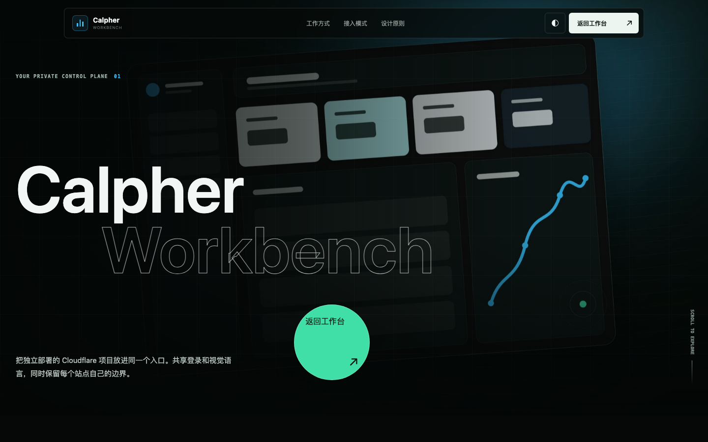
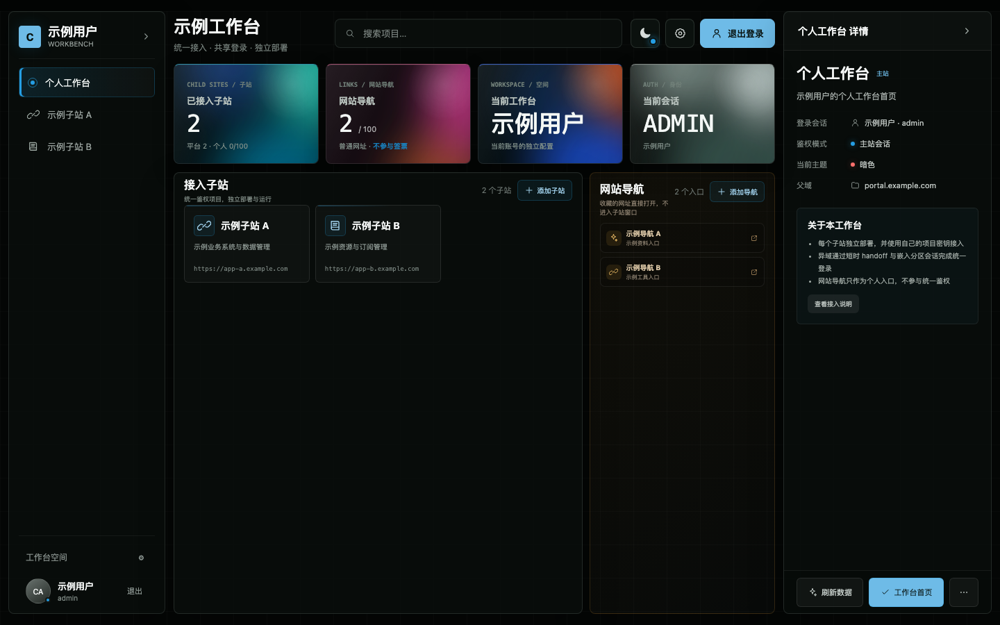

# Calpher Workbench

Cloudflare Worker 个人工作台，支持管理员、普通成员、跨域统一鉴权、个人项目与网站导航。

## 界面预览

### 门户首页

### 个人工作台

## 数据与账号

- 管理员账号密码：`AUTH_MASTER_NAME`、`AUTH_MASTER_PASS`，保存在 Cloudflare 环境变量。
- 普通成员与工作台数据：`WORKBENCH_KV`。
- 普通成员默认 3 个统一鉴权项目、10 个网站导航，管理员可调整。
- 成员密码保存 PBKDF2-SHA256 摘要和 AES-GCM 加密保险箱；管理员可通过专用接口按需查看。
- 平台与个人子站都使用项目独立密钥，主站会话密钥不与任何子站共享。

## 三类入口

- `apps.json`：管理员维护的平台子站元数据；独立密钥和删除状态保存在 `WORKBENCH_KV`。
- 个人接入项目：管理员或成员在工作台创建，每个项目使用独立密钥。
- 网站导航：个人导航，不共享登录，不进入 handoff 白名单。

## 子站快速接入

1. 在主站工作台新增子站，填写 HTTPS 地址，并获取该项目的独立密钥。
2. 子站复制或按技术栈适配主站 `auth/auth.js`，保留原有鉴权作为独立站回退。
3. 配置 `AUTH_MASTER_ORIGIN`，再用 `wrangler secret put AUTH_COOKIE_SECRET` 写入该项目的独立密钥。
4. 接入 handoff callback、统一退出和页面 API 的 `401 + loginUrl` 处理；不要改变机器接口或公开订阅的原鉴权语义。
5. 需要桌面嵌入时，实现 `embed`、`ready` 和主题同步协议；需要移动端返回入口时识别 `from=workbench`。
6. 分别验证统一鉴权模式和移除任一接入变量后的独立站模式，再按验收清单发布。

完整创建、接入、安全与验收规则见 [`docs/接入标准.md`](docs/接入标准.md)；鉴权模块摘要见 [`auth/README.md`](auth/README.md)。

---

> 本项目仅供学习、研究与个人技术实践参考，请勿用于违法用途或未经授权的系统。
